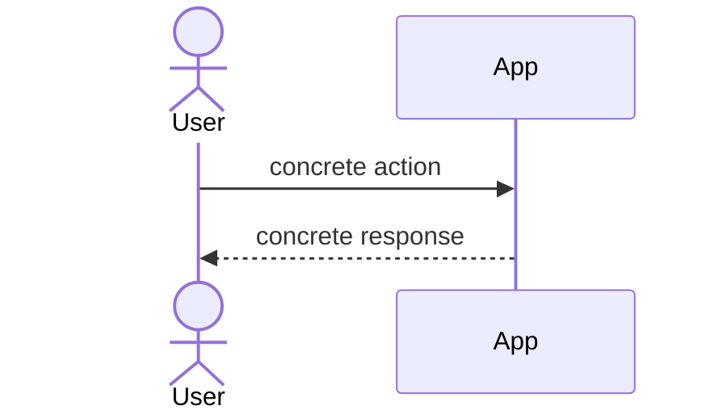
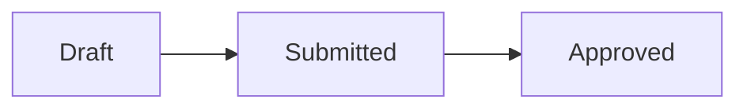

# User Flow

IMPORTANT: Never auto-commit. Never auto-post to Slack without showing the doc and getting confirmation first.

## When To Use

After a kickoff call, before architecture. This doc is the gate that prevents building the wrong thing. It must be readable by a product lead or non-technical stakeholder.

This is NOT:

- A data model or schema
- API design
- Code architecture
- A full PRD

It IS:

- A simplified description of user flows
- A high-level view of how the system works
- Something a non-coder can read, understand, and iterate on

## Process

1. Ask the user for context:
   - What was discussed in the kickoff call?
   - Who are the actors?
   - What problem are we solving from the user's perspective?
   - Is there a kickoff notes doc, Slack thread, or Linear ticket to pull from?

2. Interview briefly to resolve gaps. Keep it lightweight — this is not `$grill-me`. Only ask what you need to draft the flow.

3. Explore the codebase only if you need to verify where this feature fits in the existing system. Do not go deep into implementation.

4. Draft the user flow doc using the template below.

5. Present the draft for review. Iterate until the user is happy.

6. After approval, format it for Slack posting:
   - Preserve mermaid diagrams
   - Plain language
   - Include a line at the top tagging the approver (Santosh, Connor, or Tarun) for async feedback

7. Wait for the user's explicit "post it" confirmation before sending anything. If Linear MCP or Slack tools are in scope, the user must approve before any write action.

8. Once business alignment is confirmed, suggest `$arch-brief` as the next step.

## Template

<user-flow-template>

# <Feature Name> — User Flow

## Problem

2 to 3 sentences describing the problem from the user's perspective. No jargon. No references to the system.

## Who This Is For

Bullet list of actors and their goals. One line each.

- **<Actor>** — <what they want to do and why>

## Primary Flow

A mermaid sequence diagram showing the happy path. Use realistic names and dialogue, not abstract labels.

Follow with 2 to 3 sentences of plain narrative walking through the diagram with a concrete example.

## Key States

If the feature has stateful objects that the user interacts with, include a mermaid flowchart of user-visible states and transitions. If not, skip this section.

## Edge Cases Worth Calling Out

User-visible edge cases only. Not implementation edge cases.

- What happens if <realistic scenario>?
- What happens if <another realistic scenario>?

## Out Of Scope

Explicit non-goals. Keeps the discussion focused.

- <Thing we are not doing> — <why>

## Open Questions For Product

Things that need product input before moving to architecture.

- <Question 1>
- <Question 2>

</user-flow-template>

## Quality Checks

- A product lead can read the whole doc in under 3 minutes
- No schema, columns, enums, or code anywhere in the doc
- No file paths, no API signatures, no function names
- Diagrams use realistic actors and realistic actions
- Edge cases are user-visible, not internal
- Open questions are explicit and not buried in the narrative
- Out of scope is listed — silence is not a substitute for an explicit non-goal

## Next Step

After business approval, suggest `$arch-brief` to design the implementation approach.
