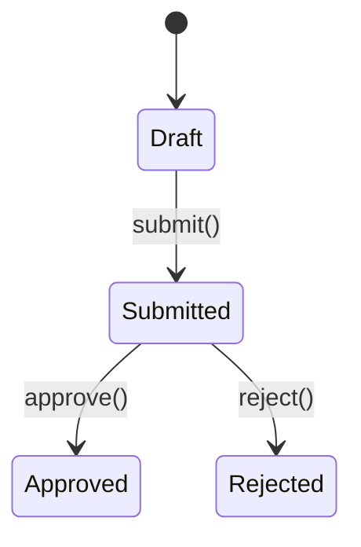

# Write A PRD

IMPORTANT: Never auto-commit. Never auto-submit to Linear without showing the PRD to the user first and getting confirmation.

## When To Use

After `$arch-brief` is approved and the team is aligned. Before `$prd-to-issues`. This is a purely engineering-facing document — schema, API contracts, module interfaces, acceptance criteria, and testing decisions. Stakeholders and leadership read the `$user-flow` doc; they do not read this.

## Process

1. Pull in the approved `$arch-brief` from context. If no arch-brief exists yet, suggest `$arch-brief` first.
2. Explore the repo to verify assumptions: existing models, APIs, patterns, and integration points.
3. Interview the user until all implementation branches are resolved — schema decisions, interface contracts, auth requirements, and testing strategy.
4. Design the module boundaries. Look for deep modules with simple interfaces and testable seams.
5. Resolve all open technical questions before drafting. Unresolved questions block issue breakdown.
6. Ask where the PRD should live in Linear:
   - New Linear project
   - Existing Linear project
   - Existing Linear issue
   - New issue under an existing parent
7. Determine the correct team, project, and parent item.
8. Draft the PRD using the template below.
9. Present the PRD for review. After approval, use Linear MCP tools or the Linear CLI to create or update the destination item.
10. After submission, suggest `$prd-to-issues` to break the work into epics and stories.

## PRD Template

<prd-template>

## Feature Context

Reference the approved user-flow doc and arch-brief. Engineers reading this should have already read both.

One paragraph framing what is being built and why — in engineering terms.

## Acceptance Criteria

A numbered, concrete, testable list of behaviors that define "done". Each criterion should be directly mappable to a test.

1. Given <state>, when <action>, then <observable outcome>
2. Given <state>, when <action>, then <observable outcome>

## Data Model

Schema changes, new tables/collections, field names, types, constraints, enums, indexes. Specific enough to implement from directly.

## API Contracts

For each new or modified endpoint, mutation, or subscription:

- **Route / method**
- **Request shape** — required fields, types, validation rules
- **Response shape**
- **Error conditions and codes**
- **Auth requirements**

## Module Design

For each module to build or modify, a named section:

### <Module Name>

- **Interface** — public entry points, parameters, return types
- **Responsibility** — what it owns, what it does not
- **Dependencies** — what it calls; what calls it
- **Hidden complexity** — what the interface conceals from callers
- **Testable boundary** — where integration tests should pin behavior

## State Machine

If the feature has stateful domain objects, include a mermaid state diagram with guards, side effects, and external consequences:

If no stateful objects, skip this section.

## Integration Points

- Which existing modules change and how
- Which external services are called
- Webhook triggers, event emissions, or background jobs

## Testing Strategy

- Which modules are highest-risk and need the deepest test coverage
- What a good behavioral test looks like at the boundary for each high-risk module
- Existing test patterns in the codebase to follow
- For agent / LLM components: follow the eval-driven protocol in `tdd/evals.md`

## Security Considerations

Skip if not applicable. If relevant, include:

- Auth and authz requirements
- Input validation boundaries
- Data that must not be exposed
- Rate limiting or abuse vectors

## Open Technical Questions

Unresolved decisions that would change the design. These must be resolved before `$prd-to-issues`.

- <Question 1>
- <Question 2>

## Out of Scope

Explicit non-goals with brief reasons. If it is not listed here, it is in scope.

- <Non-goal> — <why>

</prd-template>

## Quality Checks

- No user-facing language, no stakeholder sections — this doc is for engineers only
- Every acceptance criterion is testable without ambiguity
- Every module section has an interface, a responsibility boundary, and a testable seam
- Schema and API contracts are specific enough to implement from directly
- All open technical questions are resolved before this doc is submitted to Linear
- State machine includes guards and side effects, not just happy-path transitions
